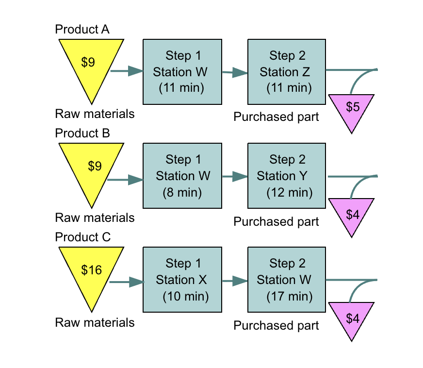
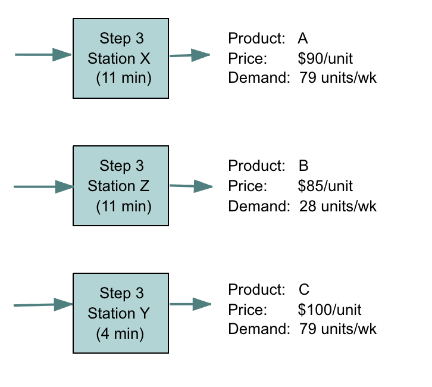

# MGMT 339 — Exam 2

**Date:** March 2026

**Name:** __________________

**CWID:** __________________

## FORMULAS

**Learning Curve**

$$T_n = T_1 \cdot n^b \quad \text{where } b = \frac{\ln(r)}{\ln(2)}$$

**Doubling shortcut:** Multiply by $r$ each time output doubles: 1 → 2 → 4 → 8 → …

---

**Control Charts — X̄ and R**

| | Formula |
|---|---|
| X̄ chart limits | $\bar{\bar{X}} \pm A_2\bar{R}$ |
| R chart UCL | $D_4\bar{R}$ |
| R chart LCL | $D_3\bar{R}$ |

| $n$ | $A_2$ | $D_3$ | $D_4$ |
|---|---|---|---|
| 2 | 1.880 | 0 | 3.267 |
| 3 | 1.023 | 0 | 2.575 |
| 4 | 0.729 | 0 | 2.282 |
| 5 | 0.577 | 0 | 2.115 |

**p-Chart**

$$\bar{p} = \frac{\text{total defects}}{\text{total observations}} \qquad \sigma_p = \sqrt{\frac{\bar{p}(1-\bar{p})}{n}} \qquad UCL/LCL = \bar{p} \pm 3\sigma_p$$

**Process Capability**

$$C_p = \frac{USL - LSL}{6\sigma} \qquad C_{pk} = \min\!\left(\frac{USL - \mu}{3\sigma},\ \frac{\mu - LSL}{3\sigma}\right)$$

---

**Lean Systems**

$$\text{Takt Time} = \frac{\text{Available time per day}}{\text{Daily demand}} \qquad \text{Lead Time} = \sum\frac{WIP_i}{\text{Daily demand}} \qquad PCE = \frac{\text{Processing time}}{\text{Lead time}}$$

$$k = \frac{d(v + r)(1 + a)}{c}$$

---

**Constraints — TOC**

$$CM = \text{Price} - \text{Raw Material Cost} \qquad \frac{CM}{\text{Bottleneck time (min/unit)}}$$

**Capacity**

$$M = \frac{\displaystyle\sum_p \left[\frac{D_p \cdot p_p}{N} + \frac{D_p}{Q_p} \cdot s_p\right]}{1 - c/100}$$

---

## CONCEPTUAL QUESTIONS — OBJECTIVE (10 Questions)

### **Question 1 (3 points) - Multiple Choice**

A hospital emergency department sees a highly varied mix of patients — some need a quick prescription refill while others require complex trauma care. The department uses flexible staffing, allows considerable nurse discretion, and workflows differ patient to patient. A consultant recommends standardizing processes into fixed protocols to improve efficiency.

Which of the following best describes the risk of this recommendation?

- [ ] A) Standardizing will increase capital intensity, which is always too expensive for service settings

- [ ] B) The recommendation would push the department off the strategic diagonal — imposing low-divergence structure on a high-contact, high-customization process

- [ ] C) Fixed protocols will increase resource flexibility, which conflicts with lean principles

- [ ] D) Standardization always leads to diseconomies of scale in service settings

---

### **Question 2 (3 points) - Multiple Choice**

A regional bakery has grown rapidly and now supplies 300 grocery stores. The owner is considering investing $2 million in a fully automated bread line that can produce only one product type at a constant rate.

Which of the following is the most accurate concern about this decision?

- [ ] A) Automation always creates diseconomies of scale, so the investment is never justified

- [ ] B) Fixed automation requires high, stable volume — if demand is variable or the product mix shifts, the investment loses its economic justification

- [ ] C) Flexible automation would be worse here because it cannot handle high volume

- [ ] D) The bakery should remain a job process to preserve customer involvement

---

### **Question 3 (3 points) - Multiple Choice**

CrestBrew, a regional craft beer company, has grown rapidly and is now evaluating whether to build a single large 120,000 sq ft brewing facility or stick with their current two smaller 60,000 sq ft facilities. The COO pushes back on the expansion plan, warning: *"At that scale, diseconomies of scale may start to creep in — we should think carefully before going bigger."*

What does the COO most likely mean by this warning?

- [ ] A) A larger facility will require more expensive equipment, but the quality of beer produced will be lower

- [ ] B) Beyond an optimal scale, average cost per unit begins to rise as coordination complexity, management overhead, and operational inefficiencies outweigh the benefits of size

- [ ] C) Larger facilities cannot respond as quickly to seasonal demand fluctuations as smaller ones

- [ ] D) Consolidating into one location will increase transportation costs to regional distributors

---

### **Question 4 (3 points) - Multiple Choice**

A paint shop tracks the number of surface defects per car body coming off the line. Each day, one car body is fully inspected and the total number of surface defects is counted.

Which control chart should be used, and why?

- [ ] A) X̄ and R chart — because paint quality is a continuous measurement taken in groups

- [ ] B) p-chart — because each car body either passes or fails inspection

- [ ] C) c-chart — because we are counting the number of defects on a single inspected unit, and one unit can have multiple defects

- [ ] D) p-chart — because sample sizes at automotive plants are always large

---

### **Question 5 (3 points) - Matching**

At Imroze Bakery, the operations manager has been conducting waste walks across the production floor. Match each observed situation to the correct type of waste.

| # | Observation | Waste Type |
|---|---|---|
| 1 | Baked loaves are held in large staging bins for hours before packaging begins, tying up floor space and making batch tracking difficult. | _______________ |
| 2 | Bakers frequently walk to the far end of the kitchen to retrieve ingredient bins that are not stored at their workstation. | _______________ |
| 3 | The packaging line can wrap 200 loaves per hour, but the oven only outputs 120 loaves per hour, leaving packaging staff idle. | _______________ |
| 4 | Roughly 9% of loaves are rejected after cooling due to underbaking and must be discarded or repurposed, consuming labor and ingredients. | _______________ |

**Options:** Inventory · Motion · Waiting · Defects · Transportation

---

### **Question 6 (3 points) - Multiple Choice**

Harvest Fresh, a large-scale food packaging company, has been struggling with throughput limitations on its canning line. The newly hired operations director, Marcus Webb, presents his improvement roadmap to the executive team:

*"Here is our plan. First, we identify which station on the canning line is limiting our output. Second, we squeeze every unit of capacity we can out of that station without new investment. Third, we align everything else in the plant to support that station's pace. Fourth, if it's still the constraint after all that, we invest in additional capacity to break the limit. This is our TOC implementation plan."*

Marcus's plan represents the complete TOC methodology.

- [ ] A) True

- [ ] B) False

---

### **Question 7 (3 points) - Multiple Choice**

NeoZapato is comparing two product mix strategies. Under the bottleneck method, the mix shifts toward products with lower total contribution margin per unit but better contribution margin per bottleneck minute.

A student argues: *"The traditional method must be better because it prioritizes the highest contribution margin per unit."* What is the flaw in this reasoning?

- [ ] A) The traditional method actually minimizes contribution margin — the student has it backwards

- [ ] B) When a resource is constrained, what matters is margin generated per unit of the scarce resource, not per unit of product — the bottleneck method maximizes total weekly profit even when some individual product margins are lower

- [ ] C) The student is correct — contribution margin per unit always produces the highest total profit regardless of constraints

- [ ] D) The bottleneck method only applies when all products use the same workstation

---

### **Question 8 (3 points) - Multiple Choice**

In a DBR system, the mechanism that controls the rate at which the bottleneck dictates the throughput of the entire plant by syncing with the materials release schedule is called the:

- [ ] A) Drum

- [ ] B) Buffer

- [ ] C) Kanban

- [ ] D) Rope

---

### **Question 9 (3 points) - Multiple Choice**

VineRidge Winery has been producing premium California wines for over two decades. When two of its largest rivals — Sonoma Hills and Pacific Crest Vineyards — each announced plans to expand their bottling and storage facilities by 35%, VineRidge's board quickly approved a comparable expansion, despite internal forecasts showing current capacity is still sufficient for the next two years.

Which capacity timing strategy is VineRidge following?

- [ ] A) Expansionist

- [ ] B) Follow the leader

- [ ] C) Wait-and-see

- [ ] D) Theory of Constraints

---

### **Question 10 (3 points) - Multiple Choice**

A control chart shows one point falling below the Lower Control Limit on a p-chart. The operations manager says: *"That's good news — fewer defects than expected. No action needed."*

What is the most accurate response?

- [ ] A) She is correct — points below the LCL always indicate process improvement and require no investigation

- [ ] B) She is incorrect — a point outside either limit, including below the LCL, signals an assignable cause. An unusually low defect rate could reflect a genuine improvement, but it could also mean a recording error or sampling problem. Both warrant investigation

- [ ] C) She is partially correct — points below the LCL are only concerning if they occur in two consecutive shifts

- [ ] D) p-charts do not have a Lower Control Limit, so the observation should be excluded from the chart

---

## QUANTITATIVE PROBLEMS (15 Questions)

### Process Analysis (8 pts)

*NeoZapato operates two production facilities. Last week's data is summarized below. Each pair of sandals sells for $40.*

| | Tijuana Facility | Los Angeles Facility |
|---|---|---|
| Pairs produced | 1,600 | 2,100 |
| Labor hours worked | 320 | 350 |
| Labor cost ($) | $3,840 | $15,750 |
| Materials cost ($) | $2,800 | $5,200 |
| Overhead cost ($) | $1,200 | $3,000 |

### **Question 11 (3 points) - Multiple Choice**

Which facility has higher **labor productivity** (pairs per labor hour)?

- [ ] A) Tijuana — 5.00 pairs/hr vs. Los Angeles — 4.00 pairs/hr

- [ ] B) Los Angeles — 6.00 pairs/hr vs. Tijuana — 5.00 pairs/hr

- [ ] C) Tijuana — 6.00 pairs/hr vs. Los Angeles — 5.00 pairs/hr

- [ ] D) Both facilities have equal labor productivity

---

### **Question 12 (5 points) - Multiple Choice**

Which facility has higher **multifactor productivity**, and what does the comparison reveal about the two operations?

- [ ] A) Los Angeles (MFP = 3.51) outperforms Tijuana (MFP = 8.16); higher output drives higher MFP

- [ ] B) Tijuana (MFP = 8.16) outperforms Los Angeles (MFP = 3.51); despite lower labor productivity, Tijuana's far lower input costs generate more output value per dollar spent

- [ ] C) Los Angeles (MFP = 4.50) outperforms Tijuana (MFP = 3.20); higher labor productivity always leads to higher MFP

- [ ] D) Both facilities have the same MFP because they sell sandals at the same price

---

### Quality Management (22 pts)

*TechAssemble's quality inspector selects 4 motherboards per shift and measures a critical dimension (mm). Data from 5 shifts shown below. Constants for n = 4: A₂ = 0.729, D₃ = 0, D₄ = 2.282.*

| Shift | x₁ | x₂ | x₃ | x₄ |
|---|---|---|---|---|
| 1 | 10.4 | 10.2 | 10.5 | 10.3 |
| 2 | 10.1 | 9.8 | 10.3 | 10.2 |
| 3 | 10.6 | 10.7 | 10.4 | 10.5 |
| 4 | 10.2 | 10.3 | 10.1 | 10.4 |
| 5 | 10.5 | 10.3 | 10.4 | 10.6 |

### **Question 13 (5 points) - Multiple Choice**

Calculate $\bar{\bar{X}}$, $\bar{R}$, and the X̄ chart control limits. Round to 3 decimal places.

- [ ] A) $\bar{\bar{X}}$ = 10.340, $\bar{R}$ = 0.340 → UCL = 10.588, LCL = 10.092

- [ ] B) $\bar{\bar{X}}$ = 10.330, $\bar{R}$ = 0.360 → UCL = 10.593, LCL = 10.067

- [ ] C) $\bar{\bar{X}}$ = 10.280, $\bar{R}$ = 0.340 → UCL = 10.528, LCL = 10.032

- [ ] D) $\bar{\bar{X}}$ = 10.340, $\bar{R}$ = 0.400 → UCL = 10.632, LCL = 10.048

---

### **Question 14 (3 points) - Multiple Choice**

Using the limits from Question 13, is the process in control? What is the UCL for the R chart?

- [ ] A) All shifts in control; UCL_R = 0.776

- [ ] B) Shift 2 is out of control on the X̄ chart; UCL_R = 0.776

- [ ] C) Shift 3 is out of control on the X̄ chart; UCL_R = 0.776

- [ ] D) All shifts in control; UCL_R = 0.822

---

### **Question 15 (6 points) - Multiple Choice**

*Specification for a valve stem diameter: 12.00 ± 0.30 mm. Process data: μ = 12.15 mm, σ = 0.09 mm.*

Calculate $C_p$ and $C_{pk}$. Does this process meet 4-sigma capability ($C_{pk} \geq 1.33$)?

- [ ] A) $C_p$ = 1.11, $C_{pk}$ = 0.56; does not meet 4-sigma

- [ ] B) $C_p$ = 1.11, $C_{pk}$ = 0.83; does not meet 4-sigma

- [ ] C) $C_p$ = 1.11, $C_{pk}$ = 1.11; meets 4-sigma

- [ ] D) $C_p$ = 1.67, $C_{pk}$ = 0.56; does not meet 4-sigma

---

### **Question 16 (8 points) - Multiple Choice**

*NeoZapato inspects batches of 200 sandal pairs per shift. Defective counts over 10 shifts:*

| Shift | 1 | 2 | 3 | 4 | 5 | 6 | 7 | 8 | 9 | 10 |
|---|---|---|---|---|---|---|---|---|---|---|
| Defectives | 8 | 5 | 12 | 3 | 9 | 14 | 6 | 4 | 10 | 9 |

Calculate $\bar{p}$, $\sigma_p$, UCL, and LCL (set to 0 if negative). Which shift, if any, is out of control?

- [ ] A) $\bar{p}$ = 0.040, UCL = 0.082, LCL = 0; Shift 6 is out of control

- [ ] B) $\bar{p}$ = 0.040, UCL = 0.082, LCL = 0; all shifts in control

- [ ] C) $\bar{p}$ = 0.040, UCL = 0.096, LCL = 0; all shifts in control

- [ ] D) $\bar{p}$ = 0.045, UCL = 0.090, LCL = 0; Shift 6 is out of control

---

### Lean Systems (16 pts)

*VeloShip Fulfillment processes orders through 4 sequential steps. Available time: 1 shift × 8 hours/day. Daily demand: 480 orders.*

| Step | Cycle Time | Uptime | WIP Before Step |
|---|---|---|---|
| Receive & Sort | 20 sec | 100% | 1,200 orders |
| Pick & Pack | 45 sec | 90% | 2,880 orders |
| Quality Check | 30 sec | 100% | 960 orders |
| Label & Ship | 25 sec | 100% | 480 orders |

### **Question 17 (4 points) - Multiple Choice**

What is takt time, and which step is the bottleneck? *Use effective C/T = cycle time ÷ uptime.*

- [ ] A) Takt = 60 sec; bottleneck is Pick & Pack (effective C/T = 50 sec); line CAN meet demand

- [ ] B) Takt = 60 sec; bottleneck is Quality Check (30 sec); line CAN meet demand

- [ ] C) Takt = 57.6 sec; bottleneck is Pick & Pack (effective C/T = 50 sec); line CANNOT meet demand

- [ ] D) Takt = 60 sec; bottleneck is Pick & Pack (effective C/T = 50 sec); line CANNOT meet demand

---

### **Question 18 (4 points) - Multiple Choice**

What is the production lead time?

- [ ] A) 7.5 days

- [ ] B) 9.5 days

- [ ] C) 11.5 days

- [ ] D) 13.0 days

---

### **Question 19 (8 points) - Multiple Choice**

*Kanban loop between Pick & Pack and Quality Check: d = 480 orders/day, waiting/handling time v = 2 hours, processing time per container r = 0.5 hours, safety factor a = 10%, container size c = 20 orders. Workday = 8 hours. Convert v and r to days before solving.*

How many containers should be authorized?

- [ ] A) 5 containers

- [ ] B) 6 containers

- [ ] C) 7 containers

- [ ] D) 8 containers

---

### Theory of Constraints (20 pts)

*Metcalf Inc. produces three products through four workstations. Available: 2,400 min/week per workstation. Fixed labor: $3,200/week. Overhead: $4,000/week.*

| Product | Price | Raw Material | Weekly Demand | A (min) | B (min) | C (min) | D (min) |
|---|---|---|---|---|---|---|---|
| X | $90 | $30 | 80 units | 10 | — | 15 | 10 |
| Y | $75 | $20 | 60 units | — | 20 | 10 | 15 |
| Z | $60 | $15 | 100 units | 8 | 12 | 8 | — |

### **Question 21 (8 points) - Multiple Choice**

If all products are made at maximum demand, which workstation is the bottleneck, and by how many minutes does its total workload exceed available capacity?

- [ ] A) Bottleneck is Workstation B; total load = 2,400 min — exactly at capacity, no overflow

- [ ] B) Bottleneck is Workstation C; total load = 2,600 min — exceeds capacity by 200 min

- [ ] C) Bottleneck is Workstation C; total load = 2,600 min — exceeds capacity by 400 min

- [ ] D) Bottleneck is Workstation A; total load = 2,000 min — exceeds capacity by 200 min

---

### **Question 22 (12 points) - Multiple Choice**

Using the **bottleneck method**, rank the products by contribution margin per bottleneck minute and determine the optimal weekly product mix and weekly profit.

- [ ] A) Z ($5.625/min) > Y ($5.50/min) > X ($4.00/min); optimal: Z = 100, Y = 60, X = 66; weekly profit = $4,560

- [ ] B) Y ($5.50/min) > Z ($5.625/min) > X ($4.00/min); optimal: Y = 60, Z = 100, X = 66; weekly profit = $4,275

- [ ] C) X ($4.00/min) > Y ($5.50/min) > Z ($5.625/min); optimal: X = 80, Y = 60, Z = 75; weekly profit = $3,980

- [ ] D) Z ($5.625/min) > Y ($5.50/min) > X ($4.00/min); optimal: Z = 100, Y = 60, X = 80; weekly profit = $5,200

---

### Capacity (5 pts)

*PeakForm Athletic manufactures two lines of yoga mats on identical molding machines. The plant runs one 8-hour shift per day, 250 days per year, and maintains a 25% capacity cushion.*

| | Standard Mat | Pro Mat |
|---|---|---|
| Annual Demand | 15,000 units | 7,000 units |
| Processing Time | 8 min/unit | 18 min/unit |
| Average Lot Size | 50 units/lot | 35 units/lot |
| Setup Time per Lot | 30 min/lot | 60 min/lot |

### **Question X2 (5 points) - Multiple Choice**

How many machines does PeakForm require?

- [ ] A) 2 machines

- [ ] B) 3 machines

- [ ] C) 4 machines

- [ ] D) 5 machines

### Line Balancing (8 pts)

*FrameCraft Industries assembles custom picture frames on an assembly line. The table below shows the 11 work elements, their times, and precedence relationships. The line must produce 48 frames per hour.*

| Work Element | Time (sec) | Immediate Predecessor(s) |
|---|---|---|
| A | 33 | — |
| B | 66 | A |
| C | 25 | A |
| D | 20 | B |
| E | 12 | B |
| F | 50 | B |
| G | 15 | C |
| H | 35 | D |
| I | 62 | E |
| J | 10 | G, F |
| K | 12 | H, J, I |
| **Total** | **340 sec** | |

*(Precedence diagram provided)*

### **Question X1a (2 points) - Multiple Choice**

What is the cycle time for this line?

- [ ] A) 48 seconds

- [ ] B) 60 seconds

- [ ] C) 75 seconds

- [ ] D) 90 seconds

---

### **Question X1b (3 points) - Multiple Choice**

Using the **longest task time** rule, which tasks are assigned to Station 1, and what is its idle time?

- [ ] A) {A, B} — total 99 sec, idle 0 sec

- [ ] B) {A, C, G} — total 73 sec, idle 2 sec

- [ ] C) {A, C} — total 58 sec, idle 17 sec

- [ ] D) {A, B, C} — total 124 sec, exceeds cycle time

---

### **Question X1c (3 points) - Multiple Choice**

Using the **longest task time** rule, which task(s) are assigned to Station 2, and what is its idle time?

- [ ] A) {B, E} — total 78 sec, exceeds cycle time

- [ ] B) {F} — total 50 sec, idle 25 sec

- [ ] C) {B} — total 66 sec, idle 9 sec

- [ ] D) {B, C} — total 91 sec, exceeds cycle time

---

York-Perry Industries (YPI) manufactures three guitar models (A, B, C) across four workstations (W, X, Y, Z), each with 2,400 minutes available per week. Using the product routings and demand data shown in the figure, which workstation is the bottleneck?

A) Workstation X, with a total load of 1,659 minutes
B) Workstation Z, with a total load of 1,177 minutes
C) Workstation W, with a total load of 2,436 minutes
D) Workstation Y, with a total load of 652 minutes

**Question X — Part b** *(4 pts)*

Let me solve it fully first.Both methods use nearly the same bottleneck minutes (leftover = 7 both ways) but the *mix* is completely different — that's a great exam setup. Now the question:

---

**Question X** *(6 pts)*

*Ridgeline Furniture allocates production time on its constrained CNC router (2,400 min/week) across three product lines. Weekly demand, bottleneck times, and contribution margins are shown below.*

| Product | CM | Bottleneck Time (min/unit) | CM/Bottleneck Min | Weekly Demand |
|---|---|---|---|---|
| Dining Table | $76 | 11 | $6.91 | 79 units |
| Bookshelf | $72 | 8 | $9.00 | 80 units |
| Cabinet | $80 | 17 | $4.71 | 60 units |

*Using the bottleneck method, how many units of each product should Ridgeline produce?*

- A) Bookshelf = 80, Table = 79, Cabinet = 52
- B) Cabinet = 60, Table = 79, Bookshelf = 63
- C) Bookshelf = 80, Table = 68, Cabinet = 60
- D) Cabinet = 60, Bookshelf = 80, Table = 71

---

**Answer: A**

Here's what makes it hard and what each distractor traps:

| Option | What a student did |
|---|---|
| **A ✓** | Correctly ranked by CM/min → Shelf first, then Table, Cabinet gets leftover |
| **B** | Ranked by total CM ($80 > $76 > $72) — the classic traditional-method mistake |
| **C** | Ranked correctly but miscalculated Table allocation after Bookshelf |
| **D** | Ranked by CM correctly but allocated Cabinet before Bookshelf — flipped the top two |

The trap is especially sharp here because Cabinet has the *highest* total CM ($80) but the *lowest* CM per bottleneck minute ($4.71) — students who read the table too quickly and sort by the CM column will go straight to B.

*MGMT 339 · Exam 2 · Spring 2026*
